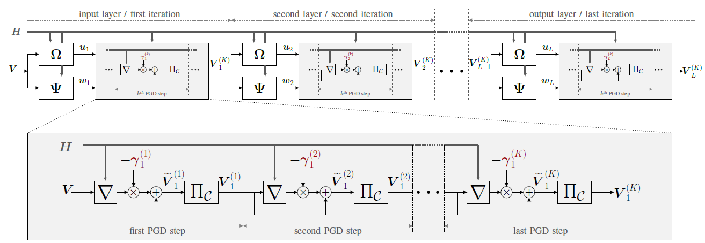

# Deep unfolding of the weighted MMSE beamforming algorithm

This GitHub repository complements our paper [[1]](#ourpaper). The user can find the code used to reproduce the plots in the paper.
In our paper we propose the novel application of **deep unfolding** to the weighted minimum mean squre error (WMMSE) in [[2]](#WMMSE_Shi).
The WMMSE algorithm is an iterative algorithm that converges to a local solution of the weigthed sum rate maximization problem subject to a power constraint, which is known to be NP-hard. As noted in [[3]](#WMMSE_E2E), the formulation of the WMMSE algorithm, as described in [[2]](#WMMSE_Shi), is not suitable to be unfolded due to the matrix inversion, the eigenvale decomposition, and bisection search performed at each itearation of the algorithm. Therefore, in our paper [[1]](#ourpaper), we propose an alternative formulation that avoids these operations. Specifically, we replace the method of Lagrangian multipliers with the **projected gradient descent (PGD) approach**. 

In the jupyter notebook "" the implementation in Python 3.6.8 of the WMMSE algorithm in [[2]](#WMMSE_Shi) and the implementation in Python 3.6.8 and Tensorflow 1.13.1 of the unfolded WMMSE algorithm can be found.

## Problem formulation
We consider a multiple-input single-output (MISO) interference downlink channel. The base station has M transmit antennas and sends independent data symbols to N single-antenna users. ) is the transmitted data symbol to user *i* and ) is the channel between user *i* and the base station.

With linear beamforming, the signal at the receiver of user *i* is 

,

where  is the beamformer for user *i* and where ) is independent additive white Gaussian noise with power . The estimated data symbol at the receiver is , where  is the receiver gain at user *i*. 
We define ![\boldsymbol{H} \triangleq \[\boldsymbol{h}_1,\boldsymbol{h}_2,\ldots,\boldsymbol{h}_N\]^T](https://render.githubusercontent.com/render/math?math=%5Cboldsymbol%7BH%7D%20%5Ctriangleq%20%5B%5Cboldsymbol%7Bh%7D_1%2C%5Cboldsymbol%7Bh%7D_2%2C%5Cldots%2C%5Cboldsymbol%7Bh%7D_N%5D%5ET), ![\boldsymbol{V}\triangleq \[\boldsymbol{v}_1,\boldsymbol{v}_2,\ldots,\boldsymbol{v}_N\]^T](https://render.githubusercontent.com/render/math?math=%5Cboldsymbol%7BV%7D%5Ctriangleq%20%5B%5Cboldsymbol%7Bv%7D_1%2C%5Cboldsymbol%7Bv%7D_2%2C%5Cldots%2C%5Cboldsymbol%7Bv%7D_N%5D%5ET), and ![\boldsymbol{u}  \triangleq \[u_1, u_2, \ldots,u_N\]^T](https://render.githubusercontent.com/render/math?math=%5Cboldsymbol%7Bu%7D%20%20%5Ctriangleq%20%5Bu_1%2C%20u_2%2C%20%5Cldots%2Cu_N%5D%5ET).

## Proposed unfolded WMMSE algorithm
Algorithm 1 reports the pseudocode of the unfolded WMMSE and Fig 1 depicts the overall neural network architecture.

where  indexes the iterations and  indexes the PGD steps, where ![\nabla f(\widetilde{{\boldsymbol{V}}}^{(k)})=~\[\nabla f(\widetilde{{\boldsymbol{v}}}^{(k)}_1), \nabla f(\widetilde{{\boldsymbol{v}}}^{(k)}_2), \ldots,\nabla f(\widetilde{{\boldsymbol{v}}}^{(k)}_N)\]^T ](https://render.githubusercontent.com/render/math?math=%5Cnabla%20f(%5Cwidetilde%7B%7B%5Cboldsymbol%7BV%7D%7D%7D%5E%7B(k)%7D)%3D~%5B%5Cnabla%20f(%5Cwidetilde%7B%7B%5Cboldsymbol%7Bv%7D%7D%7D%5E%7B(k)%7D_1)%2C%20%5Cnabla%20f(%5Cwidetilde%7B%7B%5Cboldsymbol%7Bv%7D%7D%7D%5E%7B(k)%7D_2)%2C%20%5Cldots%2C%5Cnabla%20f(%5Cwidetilde%7B%7B%5Cboldsymbol%7Bv%7D%7D%7D%5E%7B(k)%7D_N)%5D%5ET%20), where %7D_i)%20%3D-2%5Calpha_%7Bi%7Dw_%7Bi%7Du_%7Bi%7D%5Cboldsymbol%7Bh%7D_i%20%2B%202%5Cboldsymbol%7BA%7D%5Cwidetilde%7B%5Cboldsymbol%7Bv%7D%7D%5E%7B(k)%7D_i), where , and %5Cleq%20P%20%5C%5C%20%20%20%20%20%20%20%5Cfrac%7B%5Cboldsymbol%7BV%7D%7D%7B%5Cleft%5ClVert%20%5Cboldsymbol%7BV%7D%20%5Cright%5CrVert%7D%5Csqrt%7BP%7D%2C%20%26%20%5Ctext%7Botherwise.%7D%20%20%20%20%20%5Cend%7Bcases%7D%20)

*Fig. 1. The neural network architecture obtained by unfolding L iterations of the WMMSE and K projected gradient descent (PGD) steps per iteration. The trainable parameters, highlighted in red, are the step sizes of the PGD approach. Each layer of the neural network is given by the update equation of , indicated by , by the update equation of , indicated by , and by unfolding K PGD steps, as depicted in the gray box. In particular,  and indicate the gradient and the projection operations , respectively.*

## Computation Environment
In order to run the code in this repository the following software packages are needed:
* `Python 3` ( for reference we use Python 3.6.8 ), with the following packages:`numpy`, `tensorflow` (version 1.x - for reference we use version 1.13.1) , `matplotlib`,`copy`,`time`.
* `Jupyter` ( for reference we use version 6.0.3 )

## Reference

 [1] L. Pellaco, M. Bengtsson, J. Jaldén, "Deep unfolding of the weighted MMSE algorithm," submitted to IEEE Transactions of Signal Processing.

 [2] Q. Shi, M. Razaviyayn, Z. Luo and C. He, "An Iteratively Weighted MMSE Approach to Distributed Sum-Utility Maximization for a MIMO Interfering Broadcast Channel," in IEEE Transactions on Signal Processing, vol. 59, no. 9, pp. 4331-4340, Sept. 2011, doi: 10.1109/TSP.2011.2147784.

 [3] H. Sun, X. Chen, Q. Shi, M. Hong, X. Fu and N. D. Sidiropoulos, "Learning to Optimize: Training Deep Neural Networks for Interference Management," in IEEE Transactions on Signal Processing, vol. 66, no. 20, pp. 5438-5453, 15 Oct.15, 2018, doi: 10.1109/TSP.2018.2866382.

