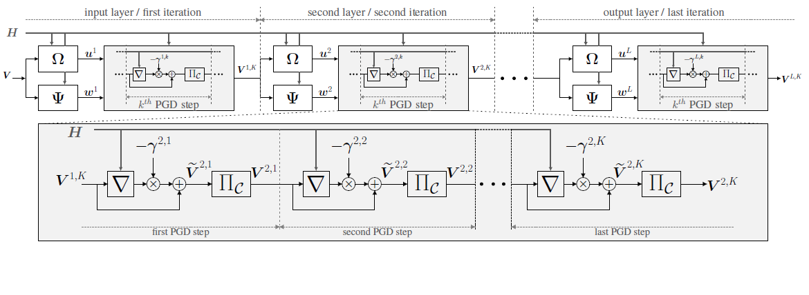

# Deep unfolding of the weighted MMSE beamforming algorithm

In this GitHub repository the user can find the code used to reproduce the plots and the results in our paper [[1]](#ourpaper).
We propose the novel application of **deep unfolding** to the weighted minimum mean square error (WMMSE) algorithm in [[2]](#WMMSE_Shi).
The WMMSE is an iterative algorithm that converges to a local solution of the weigthed sum rate maximization problem subject to a power constraint, which is known to be NP-hard. As noted in [[3]](#WMMSE_E2E), the formulation of the WMMSE algorithm, as described in [[2]](#WMMSE_Shi), is not amenable to deep unfolding due to a matrix inversion, an eigendecomposition, and a bisection search performed at each itearation. Therefore, in our paper [[1]](#ourpaper), we propose an alternative formulation that avoids these operations, while **retaining the same convergence property**. Specifically, we replace the method of Lagrange multipliers with the **projected gradient descent (PGD) approach**. In this way, the matrix inversion, the eigendecomposition, and the bisection search are replaced by simple vector operations. We refer to this variant of the original WMMSE algorithm as *unfoldable WMMSE algorithm* in order to stress its suitability to deep unfolding. By mapping each iteration of the unfoldable WMMSE algorithm to a network layer, we obtain a network architecture called **deep unfolded WMMSE**. Moreover, in order to boost the convergence of the PGD, we propose to **incorporate in the network structure Nesterov acceleration and a generalization thereof** (which we refer to as Super Nesterov) and treat such acceleration schemes as learnable structures.  

In the jupyter notebook *Deep_Unfolded_WMMSE_versus_WMMSE.ipynb* the user can find:

- The implementation in Python 3.6.8 of the WMMSE algorithm in [[2]](#WMMSE_Shi)
- The implementation in Python 3.6.8 of the zero forcing (ZF) solution
- The implementation in Python 3.6.8 of the regularized zero-forcing (RZF) solution
- The implementation in Python 3.6.8 and Tensorflow 1.13.1 of the deep unfolded WMMSE in [[1]](#ourpaper) 

In the jupyter notebooks *Nesterov_Accelerated_Deep_Unfolded_WMMSE.ipynb* and *Super_Nesterov_Accelerated_Deep_Unfolded_WMMSE.ipynb* the user can find the implementation in Python 3.6.8 and Tensorflow 1.13.1 of the accelerated deep unfolded WMMSE, with Nesterov and Super Nesteorv acceleration schemes, respectively.

The notebook cells should be run in sequential order. Note that the training time can vary from an hour to many hours, depending on the parameter settings, e.g., the number of iterations and the number of PGD steps, and on the user hardware. 

## Problem formulation
Let  be the transmitted data symbol to user  and let  be the channel between the base station and user .

With linear beamforming, the signal at the receiver of user  is 

where  is the transmit beamformer for user  and where  is independent additive white Gaussian noise with power . The signal-to-interference-plus-noise-ratio (SINR) of user  is 

The estimated data symbol at the receiver of user   is , where  is the receiver gain.

We seek to maximize the weighted sum rate (WSR) subject to a total transmit power constraint, i.e., 

where  indicates the user priority (assumed to be known) and where  is the maximum transmit power at the base station. We assume to have perfect channel knowledge. This problem is known to be NP-hard.
We define , , , and .

## Proposed unfoldable WMMSE algorithm
Algorithm 1 reports the pseudocode of the unfoldable WMMSE algorithm.  indexes the users,  indexes the layers/iterations, and  indexes the PGD steps.

## Deep unfolded WMMSE

 *Network architecture of the deep unfolded WMMSE. It is given by L iterations of the unfoldable WMMSE algorithm. The subscripts  indicate the  PGD step in the  layer/iteration. Each layer consists of the update equation of , denoted by , of the update equation of , denoted by , and of K PGD steps, as depicted in the gray box. The step sizes of the truncated PGD sequence are the trainable parameters.  and  denote the gradient and the projection operations.*

## Computation environment
In order to run the code in this repository the following software packages are needed:
* `Python 3` (for reference we use Python 3.6.8), with the following packages:`numpy`, `tensorflow` (version 1.x - for reference we use version 1.13.1), `matplotlib`,`copy`,`time`.
* `Jupyter` (for reference we use version 6.0.3).

## Reference

 [1] L. Pellaco, M. Bengtsson, J. Jaldén, "Deep unfolding of the weighted MMSE algorithm," submitted to IEEE Transactions on Signal Processing, 2021.

 [2] Q. Shi, M. Razaviyayn, Z. Luo and C. He, "An Iteratively Weighted MMSE Approach to Distributed Sum-Utility Maximization for a MIMO Interfering Broadcast Channel," in IEEE Transactions on Signal Processing, vol. 59, no. 9, pp. 4331-4340, Sept. 2011, doi: 10.1109/TSP.2011.2147784.

 [3] H. Sun, X. Chen, Q. Shi, M. Hong, X. Fu and N. D. Sidiropoulos, "Learning to Optimize: Training Deep Neural Networks for Interference Management," in IEEE Transactions on Signal Processing, vol. 66, no. 20, pp. 5438-5453, 15 Oct.15, 2018, doi: 10.1109/TSP.2018.2866382.

